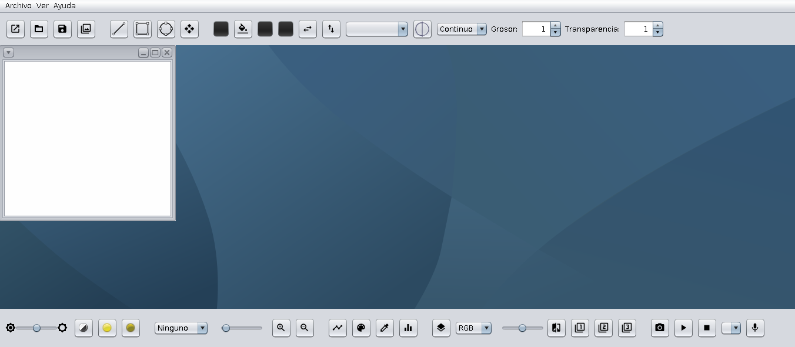

# SMProject

Práctica realizada para la asignatura de Sistemas Multimedia de la UGR

## Descripción

Este proyecto está escrito en Java, utilizando como IDE Netbeans.

Es una aplicación que orientada al uso multimedia. Con ella se puede realizar una serie de acciones, relatadas mejor en la [documentación](./doc/DocPPN.pdf). Algunas de ellas son:
- Poder pintar diferentes figuras
- Modificar sus propiedades, como el relleno, la transparencia, color...
- Tener diferentes lienzos, además de poder guardarlos como una imagen.
- Abrir y visualizar imágenes.
- Aplicarles ciertos filtros o transformaciones.
- Reproducir y grabar audio.
- Reproducir vídeo.

A continuación adjunto una captura para su previsualización:

## Agracedimientos

Este trabajo a podido ser realizado gracias a las bibliotecas y los guiones ofrecidos por el profesor Jesús Chamorro.
